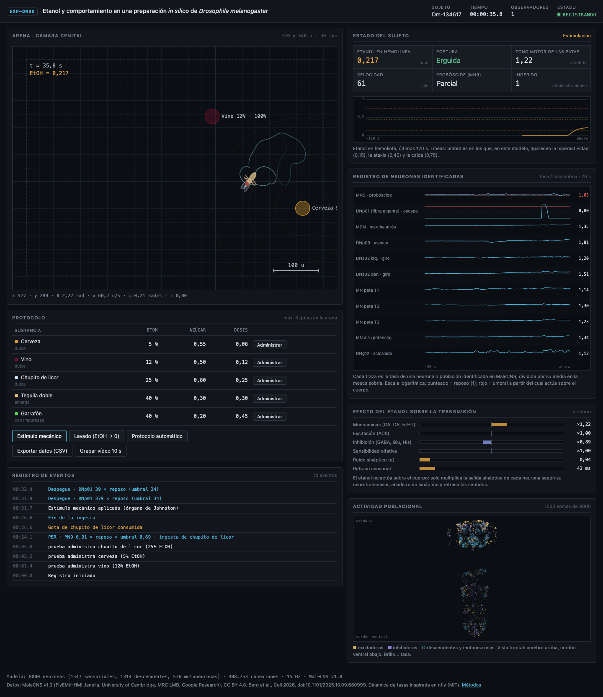
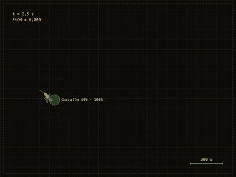
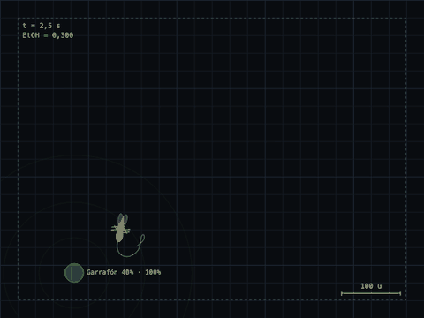
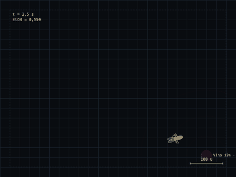
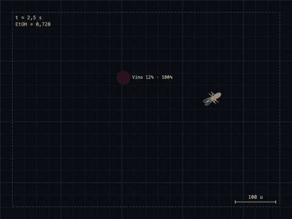
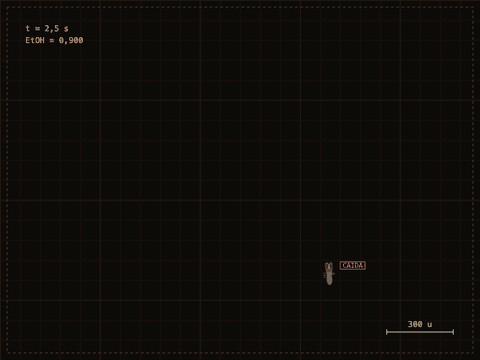
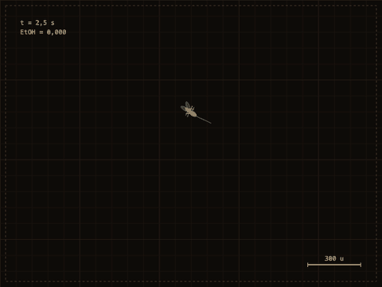

# Etanol y comportamiento en una *Drosophila* in silico gobernada por su conectoma

**¿Puede un fragmento del conectoma real de una mosca, sin ninguna conducta programada, producir por sí
solo la progresión de una intoxicación etílica?** Este proyecto lo pone a prueba. Una mosca simulada vive
en una arena; su sistema nervioso son **8.000 neuronas reales del conectoma MaleCNS v1.0** con sus
**488.753 conexiones** y sus signos, y **son esas neuronas las que deciden lo que hace**: busca comida por
el olor, prueba el sabor y bebe o rechaza según dispare su motoneurona MN9, escapa cuando la fibra gigante
supera su umbral y se sostiene mientras sus motoneuronas de las patas tengan tono. El etanol solo altera
la transmisión sináptica. Correr más, zigzaguear, caerse y perder el reflejo de enderezamiento emergen
de ahí. Un control con el cableado permutado muestra qué conductas dependen de verdad de la topología del
conectoma y cuáles no.

> **English summary.** A simulated *Drosophila* whose behaviour is produced by 8,000 real neurons of the
> MaleCNS v1.0 connectome (real wiring and signs, never modified). There are no scripted behaviours:
> feeding is triggered by the proboscis motor neuron MN9, escape by the giant fibre, posture by the tone of
> the leg motor neurons. Ethanol acts only on synaptic transmission (monoamines, cholinergic excitation,
> GABAergic inhibition, synaptic noise, sensory delay), and hyperactivity, ataxia, falls and loss of the
> righting reflex emerge from it. A degree-preserving shuffled connectome abolishes odour-guided foraging
> (92.5% → 0%) and bitter rejection (100% → 0%), while escape and sugar acceptance survive the shuffle.



| Basal | Etanol 0,3 · estimulación | Etanol 0,55 · ataxia |
|:---:|:---:|:---:|
|  |  |  |
| **Etanol 0,72 · ataxia severa** | **Etanol 0,95 · LORR** | **Estímulo mecánico · escape** |
|  |  |  |

---

## Índice

1. [Resultados](#resultados)
2. [El modelo](#el-modelo)
3. [Controles y honestidad](#controles-y-honestidad)
4. [Limitaciones](#limitaciones)
5. [Consola del experimento](#consola-del-experimento)
6. [Reproducir](#reproducir)
7. [Estructura del repositorio](#estructura-del-repositorio)
8. [Datos, créditos y referencias](#datos-créditos-y-referencias)

---

## Resultados

### 1. Las conductas básicas salen de neuronas identificadas

Prueba final sobre semillas que el modelo no ha visto (`scripts/evaluate.py tasks --test`, 40 ensayos por
tarea), comparando el conectoma real con un conectoma **permutado** que conserva exactamente el número de
conexiones de cada neurona, sus pesos y sus signos, pero baraja quién conecta con quién:

| Tarea | Conectoma real | Conectoma permutado |
|---|---:|---:|
| Encontrar una gota por el olor y beber (≤ 25 s) | **92,5 %** | **0 %** |
| Rechazar una solución amarga (40 % EtOH con impurezas) | **100 %** | **0 %** |
| Aceptar una solución dulce (5 % EtOH) | 100 % | 100 % |
| Despegar tras un golpe en la arena | 100 % | 100 % |
| Retroceder al chocar con el borde | 100 % | 100 % |
| Caídas estando sobria | 0 % | 0 % |

La búsqueda guiada por el olor y el rechazo del amargo **desaparecen** al destruir la topología: los aporta
el cableado real. Las otras tres conductas sobreviven a la permutación, así que en este modelo **no son
evidencia** de que el conectoma importe: les basta con que llegue suficiente corriente al sitio adecuado.

### 2. El etanol, actuando solo sobre las sinapsis, reproduce la progresión de la intoxicación

Nivel de etanol congelado, 24 moscas por nivel, 40 s cada una (`scripts/evaluate.py alcohol`):

| Etanol (u.a.) | Velocidad (u/s) | Giro por distancia (rad/u) | En el suelo | LORR | Encuentra y bebe |
|---:|---:|---:|---:|---:|---:|
| 0 | 39,5 | 0,050 | 0 % | 0 % | 92 % |
| 0,15 | 44,8 | 0,038 | 0 % | 0 % | 71 % |
| 0,30 | **74,2** | 0,032 | 0 % | 0 % | 25 % |
| 0,45 | 27,0 | **0,112** | 0 % | 0 % | 0 % |
| 0,60 | 16,8 | **0,223** | 0 % | 0 % | 0 % |
| 0,75 | 1,2 | 0,361 | **83 %** | **69 %** | 0 % |
| 0,90 | 0,1 | – | 99 % | 92 % | 0 % |
| 1,00 | 0,0 | – | 99 % | 92 % | 0 % |

- **Estimulación a dosis bajas**: casi el doble de velocidad a 0,3, como la hiperactividad descrita en
  moscas expuestas a etanol (Wolf et al. 2002).
- **Ataxia**: el giro por unidad de distancia se multiplica por 2-4 y la mosca deja de encontrar comida.
- **Pérdida de la postura y sedación**: a partir de ~0,75 las motoneuronas de las patas pierden tono, la
  mosca cae y no consigue enderezarse (LORR), la medida estándar de sedación en *Drosophila*.
- **Un efecto que nadie programó: la intoxicación se autolimita.** Por encima de ~0,45 la mosca ya no
  localiza las gotas, así que deja de beber. En un protocolo de administración continua con las gotas cerca
  (`scripts/run_demo.py`), 8 de 8 sujetos alcanzan ataxia severa y 2 de 8 llegan a LORR en 5 minutos.

### 3. Ablaciones

Cada una silencia un grupo de neuronas en todos los pasos, sin tocar el cableado (`tests/test_brain.py`):

| Se silencia | Consecuencia |
|---|---|
| MN9 (probóscide) | No bebe nunca, aunque esté sobre la gota |
| DNp01 (fibra gigante) | No escapa al golpe |
| Motoneuronas de las seis patas | Cae y no se levanta |
| Todo el cerebro | No se mueve |

---

## El modelo

### Selección de las 8.000 neuronas

MaleCNS v1.0 tiene unas 166.700 neuronas con clase asignada. Una primera selección por «flujo de camino»
entre sensores y descendentes no contenía **ninguna motoneurona**, ni las neuronas identificadas de la
literatura (MDN, fibra gigante, DNp09) ni receptores olfativos: ese cerebro no podía mover el cuerpo. La
selección actual (`scripts/prep.py`) usa **cupos por función**, en este orden:

| Cupo | Neuronas | Qué es |
|---|---:|---|
| Neuronas identificadas | 644 | Descendentes con función publicada (DNp09, DNa01, DNa02, DNg13, MDN, DNp01, DNp07, DNp10, DNp15, pIP10, DNg11, DNg12) y todas las poblaciones de motoneuronas |
| Descendentes | 1.244 | El resto de neuronas descendentes (están las 1.314) |
| Sensoriales | 1.300 | Gustativas del labelo y la faringe, mecanosensoriales antenales, órgano de Johnston, y receptores olfativos por su alcance a las descendentes |
| Socios de las identificadas | 1.300 | Sus presinápticas más fuertes a uno y dos saltos: sin ellas una neurona identificada queda muda |
| Vías sensor → efector | 6 × 220 | Olfato → giro, gusto → MN9, gusto de pata → MN9, tacto → MDN, vibración → fibra gigante, descendentes → patas |
| Premotoras del cordón | 900 | Reciben de descendentes y alcanzan motoneuronas |
| Cuerpo fungiforme | 200 | MBON y dopaminérgicas |
| Relleno | 1.092 | Mayor flujo de camino sensores → descendentes/motoneuronas en ≤ 4 saltos |

Resultado: 1.314 descendentes, 576 motoneuronas, 1.547 sensoriales, 132 moduladoras y 4.431
interneuronas (34,7 % inhibidoras). El 100 % de las descendentes y el 99,8 % de las motoneuronas reciben
señal sensorial en ≤ 4 saltos. Aristas de ≥ 3 sinapsis; 42 neuronas obligatorias que quedaban aisladas
recuperan sus aristas reales de 2 sinapsis (ninguna conexión se inventa). Detalle en
[`docs/subcircuit-report.md`](docs/subcircuit-report.md).

### Dinámica

Red de tasas integrada a 15 Hz, independiente del paso de integración:

```
x_i = clip( G · Σ_j W_ij · s_j · h_j · m_j  +  b_i  +  u_i  −  β_i · a_i ,  0, 5 )
h_i ← h_i + (1 − e^(−Δt/τ_i)) · (x_i − h_i)
```

- `W`: número de sinapsis normalizado por neurona postsináptica. `s_j`: signo del neurotransmisor de la
  presináptica (acetilcolina, dopamina, serotonina y octopamina excitan; GABA, glutamato e histamina
  inhiben; desconocido excita, simplificación tomada de nfly). **Nunca se modifica.**
- `τ_i` por clase: sensorial 15 ms, interneurona 30 ms, descendente 45 ms, motoneurona 75 ms.
- `a_i`: adaptación (β = 0,2, τ = 500 ms) en neuronas centrales.
- `b_i`: tono basal lognormal de media 0,003; `G` = 1,25. Elegidos por estabilidad (p99 < 5 sin entrada)
  y por la respuesta de los circuitos identificados.
- `m_j`: lo que el etanol hace a las sinapsis de la neurona `j` (ver abajo).

### Entrada sensorial

Cada señal entra por sus receptores reales (`src/mosca/senses.py`):

- **Olfato**: la concentración en cada antena activa los receptores olfativos de ese lado con curvas de
  sintonía **y** una ganancia monótona (un receptor real dispara más con más odorante; sin ella, la
  diferencia de ~1 % entre antenas quedaba invisible).
- **Gusto**: la anotación trae el órgano pero no el sabor. Qué tipos gustativos son «dulces» y cuáles
  «amargos» se decide **con el propio cableado**: se estimula cada tipo y se clasifica por su efecto neto
  sobre MN9 (`artifacts/taste_split.json`).
- **Tacto** antenal (bordes de la arena) y **vibración** por el órgano de Johnston.

### Del cerebro al cuerpo

No hay máquina de estados, temporizadores ni eventos aleatorios. Todo se lee de las neuronas
(`src/mosca/body.py`):

| Conducta | Se lee de | Regla |
|---|---|---|
| Ingesta | MN9 | Extiende la probóscide si su tasa supera el umbral (con histéresis) |
| Escape | DNp01 (fibra gigante) | Despegue si supera el umbral; mantiene el vuelo mientras las motoneuronas de potencia del ala sigan activas |
| Postura | Motoneuronas de las 6 patas | De pie si el tono medio ≥ 55 % del sobrio; si no, caída tras 0,3 s; sin recuperación en 3 s, LORR |
| Velocidad | Las mismas | La velocidad efectiva se escala por su tono |
| Acicalado, canto | DNg11/DNg12, pIP10 | Por encima de umbral con la mosca quieta |
| Rumbo y paso | 1.024 neuronas | Lectura lineal (ver abajo) |

**Los umbrales no se ajustan a ojo.** `scripts/calibrate_motor.py` los coloca entre dos respuestas
neuronales medidas en el sujeto sobrio y guarda las medidas junto a ellos (`artifacts/motor.json`):

| Umbral | Respuesta A | Respuesta B | Umbral |
|---|---|---|---|
| MN9 (ingesta) | 0,41 con solución amarga | 1,17 con solución dulce | 0,69 |
| DNp01 (escape) | 3,0 en reposo (p99,9) | 397 tras el golpe (p10) | 34 |
| Tono de patas (caída) | mínimo sobrio: 0,73 | – | 0,55 |

### La única pieza entrenada: el volante

El rumbo y el paso salen de una lectura lineal (ridge) sobre 1.024 neuronas que **no** reciben entrada
sensorial directa (las descendentes más conectadas y otras centrales). Se entrena por imitación (DAgger) de
un controlador que solo ve lo que ven los sentidos de la mosca (olor en cada antena, sabor, tacto) y nunca
dónde está la comida, y se selecciona por **alcance en lazo cerrado**, no por R²: con la lectura sola al
mando alcanza el 100 % en validación. No toca el cableado ni ve el mundo. Con el mismo volante sobre el
conectoma permutado, la mosca no encuentra ni una gota.

### Etanol

Absorción desde el buche y eliminación lineal (acelerada para que se observe en minutos). **El etanol no
actúa sobre el cuerpo**: solo modifica la salida sináptica por clase de neurotransmisor
(`configs/alcohol.yaml`):

| Efecto | Nivel 0 | 0,3 | 0,6 | 0,9 | 1,0 |
|---|---:|---:|---:|---:|---:|
| Monoaminas (OA, DA, 5-HT) | ×1 | ×1,30 | ×1,15 | ×0,80 | ×0,60 |
| Excitación colinérgica | ×1 | ×1,00 | ×0,85 | ×0,55 | ×0,35 |
| Inhibición (GABA, Glu, His) | ×1 | ×0,85 | ×1,00 | ×1,35 | ×1,60 |
| Ruido sináptico (σ, multiplicativo, media 0) | 0 | 0,05 | 0,20 | 0,35 | 0,40 |
| Retraso sensorial | 0 ms | 60 ms | 150 ms | 300 ms | 400 ms |
| Sensibilidad olfativa | ×1 | ×1,00 | ×0,85 | ×0,50 | ×0,30 |

Son hipótesis de modelado inspiradas en la farmacología del etanol (aumento de monoaminas a dosis bajas,
depresión de la excitación y potenciación GABAérgica a dosis altas). El ruido es **multiplicativo y de
media cero**: un ruido aditivo antes de la rectificación subía la tasa media de las motoneuronas y
producía el efecto contrario al buscado.

Las etiquetas de fase de la consola (basal, estimulación, ataxia, sedación) son solo nombres para rangos
de nivel; no disparan nada.

---

## Controles y honestidad

- **Conectoma permutado.** Cada arista conserva su neurona presináptica, su peso y su signo; se permuta su
  diana, con lo que se conservan los grados de entrada y salida. Es el control principal: separa lo que
  aporta la topología de lo que aporta simplemente tener neuronas con esos grados.
- **Semillas separadas.** Entrenamiento 0-1999, validación 2000-2999, prueba 10000+ (una sola vez).
- **Ablaciones** de grupos identificados (tabla de resultados).
- **Lo que no funciona como en la literatura**, y se dice:
  - **MDN**, la neurona de marcha atrás (Bidaye et al. 2014), apenas responde al tacto antenal en este
    subcircuito (1,01 → 1,09 veces su reposo). La marcha atrás la produce el volante a partir de la
    población, no MDN, y sobrevive a la permutación.
  - La **lateralización olfativa** hacia las descendentes de giro (DNa02) es casi nula: el rumbo necesita
    el volante entrenado.
  - La mosca anda el ~92 % del tiempo; una mosca real hace más pausas. No se ha añadido ninguna regla
    para corregirlo.
- **Entradas arbitrarias**, declaradas: la propia velocidad, giro y altura de la mosca entran por neuronas
  sensoriales elegidas con semilla fija (no hay propioceptores identificados para ello en el subcircuito), y
  una corriente tónica constante a las neuronas monoaminérgicas la mantiene en vigilia.
- **Ficción**: la arena, las soluciones y sus recetas, la velocidad de eliminación del etanol y el lavado.

Explicación completa, con todas las decisiones y sus motivos: [`docs/behavior.md`](docs/behavior.md).

---

## Limitaciones

- Un subcircuito de 8.000 neuronas no es la mosca entera: faltan, entre otras, la visión y casi todo el
  cuerpo fungiforme.
- Red de tasas, no de disparos; signos por neurotransmisor sin distinguir receptores (el glutamato se trata
  como inhibidor).
- Las curvas del etanol son anclas cualitativas de la literatura, no un ajuste a datos crudos.
- Unidades arbitrarias de espacio y de concentración de etanol.

---

## Consola del experimento

La interfaz web (`web/`) es una consola de registro en directo:

- **Arena** cenital con rejilla, escala, trayectoria coloreada por el nivel de etanol, isolíneas de olor
  y etiquetas de estado (ingesta, caída, LORR, vuelo).
- **Registro de neuronas identificadas**: MN9, fibra gigante, MDN, DNp09, DNa02 izquierda y derecha,
  motoneuronas de patas T1-T3 y de potencia del ala, DNg12. Tasa respecto a la del sujeto sobrio, en
  escala logarítmica, con el umbral a partir del cual cada una actúa sobre el cuerpo.
- **Estado del sujeto**: etanol en hemolinfa, postura, tono motor de las patas, velocidad, probóscide.
- **Efecto del etanol sobre la transmisión** en cada instante, por neurotransmisor.
- **Actividad poblacional** de 1.500 neuronas en la posición real de su soma.
- **Protocolo**: administración de soluciones, estímulo mecánico, lavado y protocolo automático.
- **Registro de eventos** con marca de tiempo y la causa neuronal de cada uno.
- **Exportación** de todas las variables a CSV y del vídeo de la arena.

La simulación corre en el servidor (FastAPI + WebSocket, cuerpo a 30 Hz, cerebro a 15 Hz) y es compartida
por todos los observadores; el navegador solo dibuja, sin dependencias externas.

---

## Reproducir

Requiere Python 3.12 y [uv](https://docs.astral.sh/uv/).

```bash
uv sync -p 3.12
./scripts/download_data.sh                    # MaleCNS v1.0, ~1,1 GB en data/ (reanudable)
uv run python scripts/prep.py                 # subcircuito de 8.000 -> artifacts/brain.npz
uv run python scripts/train.py norms          # tasas de referencia del sujeto sobrio
uv run python scripts/train.py readout        # volante (DAgger)   -> artifacts/readout.npz
uv run python scripts/calibrate_motor.py      # umbrales del cuerpo -> artifacts/motor.json
uv run python scripts/evaluate.py shuffle     # conectoma permutado de control
uv run python scripts/evaluate.py tasks       # tareas (añadir --brain shuffled / --test)
uv run python scripts/evaluate.py alcohol     # conducta frente al nivel de etanol
uv run python scripts/run_demo.py             # protocolo de administración continua
uv run pytest -q                              # tests
```

Los artefactos ya están en `artifacts/`, así que para abrir la consola basta con:

```bash
uv sync -p 3.12
./scripts/serve_local.sh                      # imprime la dirección local con su token
```

---

## Estructura del repositorio

```
src/mosca/
  brain.py      red de tasas sobre el cableado real; el etanol entra como multiplicador sináptico
  senses.py     entrada por receptores reales (olfato, gusto, tacto, vibración)
  body.py       postura, ingesta, escape, vuelo, acicalado y canto leídos de neuronas identificadas
  readout.py    volante lineal (la única pieza entrenada)
  alcohol.py    cinética del etanol y sus efectos por neurotransmisor
  world.py      física, olor, gusto y tacto; no decide nada
  sim.py        un sujeto: sentidos -> neuronas -> cuerpo -> mundo
  anchors.py    identificación de neuronas por anotación
  live.py, server.py, auth.py   consola en directo
scripts/        preparación, entrenamiento, calibración, evaluación y capturas
configs/        etanol, soluciones, textos de la consola
artifacts/      subcircuito, volante, normas, umbrales, evaluaciones, GIFs y capturas
docs/           comportamiento, subcircuito, notas sobre los datos
tests/          mundo, etanol, ablaciones y control permutado, servidor
web/            consola (JavaScript sin dependencias)
```

---

## Datos, créditos y referencias

**Conectoma**: MaleCNS v1.0 (FlyEM/HHMI Janelia, University of Cambridge, MRC LMB, Google Research),
licencia CC BY 4.0. Berg et al., *Cell* 2026, doi:10.1101/2025.10.09.680999. Los datos brutos no se
incluyen; `scripts/download_data.sh` los descarga.

**Dinámica**: la red de tasas, los signos por neurotransmisor y la normalización por fila están inspirados
en [nfly](https://github.com/zhengxuyu/nfly) (MIT). No se ha copiado código.

**Referencias biológicas** de las neuronas identificadas y de las anclas del etanol:

- Bidaye, S.S., Machacek, C., Wu, Y., Dickson, B.J. (2014). Neuronal control of *Drosophila* walking direction. *Science* 344: 97-101. — MDN.
- Bidaye, S.S. et al. (2020). Two brain pathways initiate distinct forward walking programs in *Drosophila*. *Neuron* 108: 469-485. — DNp09.
- von Reyn, C.R. et al. (2014). A spike-timing mechanism for action selection. *Nature Neuroscience* 17: 962-970. — fibra gigante.
- Shiu, P.K., Sterne, G.R. et al. (2024). A *Drosophila* computational brain model reveals sensorimotor processing. *Nature* 634: 210-219. — MN9 y gusto.
- Hampel, S. et al. (2015). A neural command circuit for grooming movement control. *eLife* 4: e08758.
- Wolf, F.W., Rodan, A.R., Tsai, L.T.-Y., Heberlein, U. (2002). High-resolution analysis of ethanol-induced locomotor stimulation in *Drosophila*. *Journal of Neuroscience* 22: 11035-11044.
- Scholz, H., Ramond, J., Singh, C.M., Heberlein, U. (2000). Functional ethanol tolerance in *Drosophila*. *Neuron* 28: 261-271.
- Devineni, A.V., Heberlein, U. (2009). Preferential ethanol consumption in *Drosophila* models features of addiction. *Current Biology* 19: 2126-2132.

Ninguna mosca real ha sido expuesta a etanol para este proyecto.
