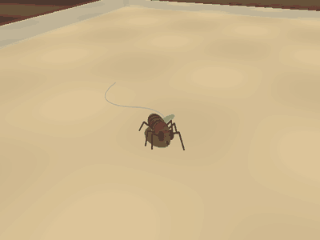
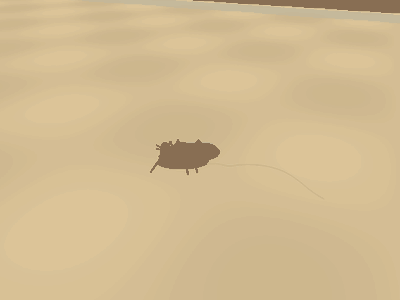
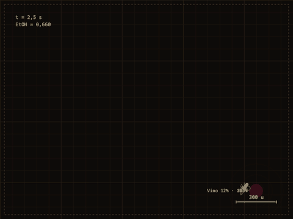
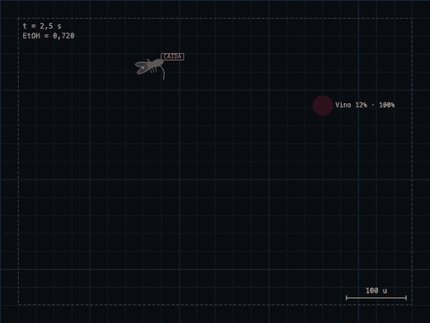

# Etanol y comportamiento en una *Drosophila* in silico gobernada por su conectoma

**¿Puede un fragmento del conectoma real de una mosca, sin ninguna conducta programada, producir por sí
solo la progresión de una intoxicación etílica?** Este proyecto lo pone a prueba. Una mosca simulada vive
en una arena; su sistema nervioso son **20.000 neuronas reales del conectoma MaleCNS v1.0** con sus
**1.319.744 conexiones** y sus signos, y **son esas neuronas las que deciden lo que hace**:
- busca comida guiándose por el olor de cada sustancia, que llega a sus receptores glomérulo a glomérulo;
- prueba el sabor, y bebe o lo rechaza según dispare su motoneurona MN9;
- deja de beber cuando está saciada;
- escapa cuando la fibra gigante supera su umbral;
- se sostiene mientras sus motoneuronas de las patas tengan tono;
- aprende en su cuerpo fungiforme.

El etanol solo altera la transmisión sináptica. La hiperactividad, la pérdida de tono, la caída y la
pérdida del reflejo de enderezamiento salen de ahí. Un control con el cableado permutado muestra qué
conductas dependen de verdad de la topología del conectoma y cuáles no.

> **English summary.** A simulated *Drosophila* whose behaviour is produced by 20,000 real neurons of the
> MaleCNS v1.0 connectome (1.32 M real connections and signs, never modified). The circuits it contains
> include the complete olfactory pathway, the mushroom body with dopamine-gated plasticity, the central
> complex, leg and haltere proprioceptors, and every descending neuron. No behaviour is scripted:
> feeding is triggered by the proboscis motor neuron MN9, escape by the giant fibre, posture by the tone
> of the leg motor neurons. Hunger acts as a hormonal gain on the sweet and bitter receptors. Ethanol,
> taken by drinking or as vapour, acts only on synaptic transmission. Hyperactivity, loss of leg tone,
> repeated falls and loss of the righting reflex emerge from it. A degree-preserving shuffled connectome
> abolishes odour-guided foraging (95% → 0%), bitter rejection (100% → 0%) and backing away from walls
> (100% → 0%); escape and sugar acceptance survive the shuffle. The steering readout is bilaterally
> symmetric (it turns only on left-right differences) and takes the walking speed from the descending
> neurons only, after an unconstrained readout made drunk flies spin in place or freeze.


| Vista 3D: la mosca en la barra de un bar | Vista 3D: a 0,72 de etanol tropieza, cae y se levanta |
|:---:|:---:|
|  |  |

Vista cenital (la que usa el análisis):

| Basal | Etanol 0,45 · estimulación | Etanol 0,66 · hipotonía |
|:---:|:---:|:---:|
|  |  |  |
| **Etanol 0,72 · tropiezo** | **Etanol 0,9 · LORR** | **Estímulo mecánico · escape** |
|  |  |  |

---

## Índice

1. [Resultados](#resultados)
2. [El modelo](#el-modelo)
3. [Controles y honestidad](#controles-y-honestidad)
4. [Limitaciones](#limitaciones)
5. [Consola del experimento](#consola-del-experimento)
6. [Reproducir](#reproducir)
7. [Estructura del repositorio](#estructura-del-repositorio)
8. [Datos, créditos y referencias](#datos-créditos-y-referencias)

---

## Resultados

### 1. Las conductas básicas salen de neuronas identificadas

Prueba final sobre semillas que el modelo no ha visto (`scripts/evaluate.py tasks --test`, 40 ensayos por
tarea). Se compara el conectoma real con un conectoma **permutado**, que conserva exactamente el número de
conexiones de cada neurona, sus pesos y sus signos, pero baraja quién conecta con quién. Entre
paréntesis, la versión anterior de 8.000 neuronas.

| Tarea | Conectoma real | Conectoma permutado |
|---|---:|---:|
| Encontrar una gota por el olor y beber (≤ 25 s) | **97,5 %** (92,5 %) | **0 %** (0 %) |
| Rechazar una solución amarga (40 % EtOH con impurezas) | **100 %** (100 %) | **0 %** (0 %) |
| Retroceder al chocar con el borde | **100 %** (100 %) | **0 %** (100 %) |
| Aceptar una solución dulce (5 % EtOH) | 100 % | 100 % |
| Despegar tras un golpe en la arena | 100 % | 100 % |
| Caídas estando sobria | 0 % | 0 % |

Tres conductas **desaparecen** al destruir la topología: la búsqueda guiada por el olor, el rechazo del
amargo y la marcha atrás. Las otras dos sobreviven a la permutación, así que en este modelo **no son
evidencia** de que el conectoma importe: les basta con que llegue suficiente corriente al sitio adecuado.
La marcha atrás ha pasado por las dos columnas mientras se arreglaba el volante: ver
[Fallos encontrados y arreglados](#fallos-encontrados-y-arreglados).

### 2. El etanol, actuando solo sobre las sinapsis, produce la progresión de la intoxicación

Nivel de etanol congelado, 24 moscas por nivel, 40 s cada una (`scripts/evaluate.py alcohol`):

| Etanol (u.a.) | Velocidad (u/s) | Tono de patas (× sobrio) | En el suelo | LORR | Encuentra y bebe |
|---:|---:|---:|---:|---:|---:|
| 0 | 50,3 | 0,96 | 0 % | 0 % | 96 % |
| 0,15 | 54,6 | – | 0 % | 0 % | 92 % |
| 0,30 | 58,9 | 1,13 | 0 % | 0 % | 50 % |
| 0,45 | **65,9** | – | 0 % | 0 % | 8 % |
| 0,60 | 60,1 | 0,74 | 0 % | 0 % | 0 % |
| 0,70 | – | 0,62 | cae y se levanta (3 caídas / 30 s) | 0 % | – |
| 0,75 | 25,1 | 0,61 | **39 %** (11 caídas / 30 s) | 0 % | 0 % |
| 0,85 | – | 0,53 | 13 caídas / 30 s | – | – |
| 0,90 | 0,4 | 0,50 | **98 %** | **85 %** | 0 % |

- **Estimulación**: la velocidad sube hasta un +31 % a 0,45, como la hiperactividad descrita en moscas
  expuestas a etanol (Wolf et al. 2002).
- **Pérdida de control postural**: el tono de las motoneuronas de las patas baja poco a poco desde 0,5.
  Entre 0,7 y 0,85 la mosca **se cae y se levanta una y otra vez** (3-15 caídas cada 30 s), que es la
  pérdida de control postural que mide el inebriómetro.
- **Sedación**: hacia 0,9 ya no consigue enderezarse (LORR, 85 %), la medida estándar de sedación en
  *Drosophila*.
- **Deterioro de la búsqueda**: encuentra la comida cada vez menos desde 0,15 (96 % → 50 % a 0,3 → 0 % a 0,6).
- **Lo que no aparece**: con 8.000 neuronas, el giro por unidad de distancia se multiplicaba por 2-4
  entre 0,45 y 0,6, y se presentaba como ataxia. Con 20.000 neuronas y el volante simétrico **no
  aparece** (0,020 → 0,034). Visto el fallo de las vueltas, aquel aumento de giro era probablemente el
  mismo artefacto del volante sin simetría y no una ataxia real. No se han retocado las curvas del
  etanol para forzarlo.

### 3. Una mosca saciada no bebe, y por eso el laboratorio usa vapor

| Situación | Resultado |
|---|---|
| Sobre una gota de cerveza, hambrienta | 5,7 s de sorbo en 6 s |
| Sobre una gota de cerveza, saciada | **0 s** |
| Cerveza ofrecida sin parar durante 2 min | 9,5 s de sorbo el primer minuto, 3,1 s el segundo |
| Protocolo solo con bebidas | la mitad de las moscas se queda en 0,06 de etanol |
| Protocolo con pulsos de vapor | **8 de 8** llegan a LORR (227-241 s) |

La mosca se sacia antes de emborracharse. Por eso la sedación se estudia con **vapor de etanol**
(inebriómetro, ensayo de LORR), y así lo hace el protocolo automático de la consola.

### 4. Ablaciones

Cada una silencia un grupo de neuronas en todos los pasos, sin tocar el cableado (`tests/test_brain.py`):

| Se silencia | Consecuencia |
|---|---|
| MN9 (probóscide) | No bebe nunca, aunque esté sobre la gota |
| DNp01 (fibra gigante) | No escapa al golpe |
| Motoneuronas de las seis patas | Cae y no se levanta |
| Todo el cerebro | No se mueve |
| MDN (marcha atrás) | Sigue retrocediendo (100 %): la marcha atrás la produce el volante, no MDN |

### 5. Aprendizaje en el cuerpo fungiforme

Se empareja tres veces el olor de la cerveza con azúcar en la boca y una subida de etanol. Después, la
respuesta de las neuronas de salida del cuerpo fungiforme (MBON) al olor de la cerveza baja un **17 %**,
y a los demás olores un **15 %**. El aprendizaje ocurre, pero **generaliza**, porque todas las
sustancias comparten el componente de fruta fermentada. No se ha demostrado un cambio de preferencia en
la conducta.

---

## El modelo

### Selección de las 20.000 neuronas

MaleCNS v1.0 tiene unas 166.700 neuronas con clase asignada. La selección (`scripts/prep.py`) usa
**cupos por función**, en este orden:

| Cupo | Neuronas | Qué es |
|---|---:|---|
| Neuronas identificadas | 696 | Descendentes con función publicada (DNp09, DNa01, DNa02, DNg13, MDN, DNp01, DNp07, DNp10, DNp15, pIP10, DNg11, DNg12), todas las motoneuronas, APL y las E-PG |
| Descendentes | 1.244 | El resto (están las 1.314) |
| Sensoriales | 3.117 | Los 2.635 receptores olfativos de los 53 glomérulos, gustativas del labelo y la faringe, tacto antenal y órgano de Johnston |
| Gusto de las patas y propioceptores | 1.000 | Gustativas tarsales, propioceptores de las patas (cordotonales, campaniformes, placas de pelos) y de los halterios |
| Monoaminérgicas | 507 | Todas las dopaminérgicas, octopaminérgicas y serotoninérgicas del cerebro central |
| Lóbulo antenal | 1.142 | Neuronas de proyección e interneuronas locales |
| Cuerno lateral | 900 | Las que más reciben de las neuronas de proyección |
| Cuerpo fungiforme | 2.101 | 2.000 células de Kenyon (por entrada desde el lóbulo antenal) y las MBON |
| Complejo central | 1.500 | Las que más alcanzan a las descendentes |
| Estado interno | 571 | Neurosecretoras (IPC, DH44, Hugin…), entéricas, proyección del ganglio subesofágico y sus socias |
| Socios de las identificadas | 2.000 | Sus presinápticas más fuertes a uno y dos saltos |
| Vías sensor → efector | 6 × 300 | Olfato → giro, gusto → MN9, gusto de pata → MN9, tacto → MDN, vibración → fibra gigante, descendentes → patas |
| Premotoras del cordón ventral | 2.000 | Reciben de descendentes y alcanzan motoneuronas |
| Relleno | 1.422 | Mayor flujo de camino sensores → descendentes/motoneuronas en ≤ 4 saltos |

Resultado:
- **Clases:** 1.314 descendentes, 624 motoneuronas, 4.449 sensoriales, 446 moduladoras y 13.167
  interneuronas (29 % inhibidoras).
- **Alcance:** el 99,9 % de las descendentes y el 100 % de las motoneuronas reciben señal sensorial en
  ≤ 4 saltos.
- **Aristas:** solo las de ≥ 3 sinapsis. 96 neuronas obligatorias que quedaban aisladas recuperan sus
  aristas reales de 2 sinapsis; ninguna conexión se inventa.

Detalle en [`docs/subcircuit-report.md`](docs/subcircuit-report.md).

### Dinámica

Red de tasas integrada a 15 Hz, independiente del paso de integración:

```
x_i = clip( G · Σ_j W_ij · s_j · h_j · m_j  +  b_i  +  u_i  −  β_i · a_i ,  0, 5 )
h_i ← h_i + (1 − e^(−Δt/τ_i)) · (x_i − h_i)
```

- **`W`:** número de sinapsis normalizado por neurona postsináptica.
- **`s_j`:** signo del neurotransmisor de la presináptica. Acetilcolina, dopamina, serotonina y
  octopamina excitan; GABA, glutamato e histamina inhiben; el desconocido excita (simplificación
  tomada de nfly). **Nunca se modifica.**
- **`τ_i`** por clase: sensorial 15 ms, interneurona 30 ms, descendente 45 ms, motoneurona 75 ms.
- **`a_i`:** adaptación (β = 0,2, τ = 500 ms) en las neuronas centrales.
- **`b_i`:** tono basal lognormal de media 0,003; `G` = 1,25. Las células de Kenyon tienen además un
  umbral alto (−0,9): solo disparan con entradas coincidentes (Turner et al. 2008), y así responde
  ~9 % a cada olor, como en la mosca real.
- **`m_j`:** lo que el etanol hace a las sinapsis de la neurona `j` (ver abajo).

Un paso del cerebro tarda ~0,9 ms.

### Entrada sensorial

Cada señal entra por sus receptores reales (`src/mosca/senses.py`):

- **Olfato por glomérulo.** Cada sustancia tiene su mezcla de glomérulos: un componente común de fruta
  fermentada / vinagre (DM1, DM4, VA2, DP1m; Semmelhack y Wang 2009) más uno propio. El garrafón huele
  además por DA2 (geosmina; Stensmyr et al. 2012) y V (CO₂; Suh et al. 2004). La concentración en cada
  antena activa los receptores de ese lado.
- **Gusto.** La anotación trae el órgano pero no el sabor. Qué tipos gustativos son «dulces» y cuáles
  «amargos» se decide **con el propio cableado**: se estimula cada tipo y se clasifica por su efecto
  neto sobre MN9.
- **Hambre.** Se comprobó que las neuronas entéricas y las sensoras de nutrientes **no tienen camino
  sináptico a MN9**. En la mosca real el hambre actúa por hormonas que suben la sensibilidad de las
  gustativas dulces y bajan la de las amargas (Inagaki et al. 2012, 2014), y así se modela:
  - un buche que se llena al beber y se vacía hacia la hemolinfa (`src/mosca/gut.py`);
  - la saciedad depende del azúcar en hemolinfa y del estiramiento del buche (Gelperin 1971);
  - la ganancia de las gustativas dulces va de ×1,4 (hambrienta) a ×0,2 (saciada).
- **Propiocepción** por propioceptores reales: los de las patas codifican la velocidad mientras la mosca
  pisa el suelo, y los de los halterios, el giro.
- **Brújula**: la orientación entra por las neuronas E-PG, como un bulto sobre su glomérulo del puente
  protocerebral.
- **Tacto** antenal (bordes de la arena) y **vibración** por el órgano de Johnston.

### Del cerebro al cuerpo

No hay máquina de estados, temporizadores ni eventos aleatorios. Todo se lee de las neuronas
(`src/mosca/body.py`):

| Conducta | Se lee de | Regla |
|---|---|---|
| Ingesta | MN9 | Extiende la probóscide si su tasa supera el umbral (con histéresis) |
| Escape | DNp01 (fibra gigante) | Despegue si supera el umbral |
| Postura | Motoneuronas de las 6 patas | De pie si el tono medio ≥ 55 % del sobrio; si no, caída tras 0,3 s; sin recuperación en 3 s, LORR |
| Velocidad | Las mismas | La velocidad efectiva se escala por su tono |
| Acicalado, canto | DNg11/DNg12, pIP10 | Por encima de umbral con la mosca quieta |
| Rumbo y paso | 1.536 neuronas | Lectura lineal (ver abajo) |

**Los umbrales no se ajustan a ojo.** `scripts/calibrate_motor.py` los coloca entre dos respuestas
neuronales medidas en el sujeto sobrio y guarda las medidas junto a ellos (`artifacts/motor.json`):

| Umbral | Respuesta A | Respuesta B | Umbral |
|---|---|---|---|
| MN9 (ingesta) | 0,52 con solución amarga | 3,75 con solución dulce | 1,39 |
| DNp01 (escape) | 0 en reposo | 343 tras el golpe (p10) | 18,5 |
| Tono de patas (caída) | mínimo sobrio: 0,88 | – | 0,55 |

### La única pieza entrenada: el volante

El rumbo y el paso salen de una lectura lineal (ridge) sobre 1.536 neuronas que **no** reciben entrada
sensorial directa:
- las 512 descendentes más conectadas;
- las neuronas de proyección del lóbulo antenal y las MBON, que es donde sobrevive la diferencia de olor
  entre las dos antenas;
- las centrales más conectadas.

Es **simétrico**, como la mosca:
- **el giro** sale solo de las diferencias izquierda − derecha entre neuronas homólogas (495 tipos con
  representante en los dos lados);
- **la velocidad** sale solo de las **neuronas descendentes**, que son las que llevan la orden de
  andar a las patas.

Así, un cambio que afecta a los dos lados por igual, como el del etanol, no puede fabricar un giro.
Además:
- cada entrada está acotada a ±3 desviaciones de lo que hizo en el entrenamiento;
- el giro tiene una adaptación lenta (τ = 3 s): un giro breve pasa, y uno sostenido hacia el mismo
  lado se desvanece.

Se entrena por imitación (DAgger) de un controlador que solo ve lo que ven los sentidos de la mosca, y
nunca dónde está la comida, con episodios de las cinco sustancias, solas y mezcladas. La regularización
se elige por **alcance en lazo cerrado, menos episodios con vueltas sobre sí misma y menos tiempo
quieta** con etanol (0,3 y 0,5). **No se entrena con moscas borrachas**: eso le enseñaría a compensar el etanol. No toca el
cableado ni ve el mundo. Con el mismo volante sobre el conectoma permutado, la
mosca no encuentra ni una gota.

### Aprendizaje: la única excepción al cableado fijo

Una sinapsis célula de Kenyon → MBON se deprime cuando la célula de Kenyon está activa **y** las
dopaminérgicas que inervan esa MBON disparan por encima de su propio nivel reciente. Se recupera en unos
10 minutos (Hige et al. 2015). Solo cambian esas 22.545 sinapsis, y solo en la consola en directo.

### Etanol

Entra bebiendo (buche → hemolinfa) o por vapor, y se elimina de forma lineal (acelerada para que se
observe en minutos). **El etanol no actúa sobre el cuerpo**: solo modifica la salida sináptica por clase
de neurotransmisor (`configs/alcohol.yaml`). Las curvas son las mismas que en la versión de 8.000:

| Efecto | Nivel 0 | 0,3 | 0,6 | 0,9 | 1,0 |
|---|---:|---:|---:|---:|---:|
| Monoaminas (OA, DA, 5-HT) | ×1 | ×1,30 | ×1,15 | ×0,80 | ×0,60 |
| Excitación colinérgica | ×1 | ×1,00 | ×0,85 | ×0,55 | ×0,35 |
| Inhibición (GABA, Glu, His) | ×1 | ×0,85 | ×1,00 | ×1,35 | ×1,60 |
| Ruido sináptico (σ, multiplicativo, media 0) | 0 | 0,05 | 0,20 | 0,35 | 0,40 |
| Retraso sensorial | 0 ms | 60 ms | 150 ms | 300 ms | 400 ms |
| Sensibilidad olfativa | ×1 | ×1,00 | ×0,85 | ×0,50 | ×0,30 |

Son hipótesis de modelado inspiradas en la farmacología del etanol: aumento de monoaminas a dosis bajas,
depresión de la excitación y potenciación GABAérgica a dosis altas. Las fases que muestra la consola
(basal, estimulación, hipotonía, sedación) son solo nombres para rangos de nivel; no disparan nada.

---

## Controles y honestidad

- **Conectoma permutado.** Cada arista conserva su neurona presináptica, su peso y su signo; se permuta su
  diana, con lo que se conservan los grados de entrada y salida.
- **Semillas separadas.** Entrenamiento 0-1999, validación 2000-2999, prueba 10000+.
- **Ablaciones** de grupos identificados, y tests de que la saciedad, el vapor, la dispersión de las
  células de Kenyon y el aprendizaje funcionan (44 tests).
- **Lo que no funciona como en la literatura**, y se dice:
  - **MDN**, la neurona de marcha atrás (Bidaye et al. 2014), responde poco al choque (0,98 → 1,18 veces
    su media), y silenciarla no impide retroceder: la marcha atrás la produce el volante a partir de
    la población (y se pierde con el cableado permutado).
  - **Sin vuelo sostenido**: las motoneuronas de potencia del vuelo no suben tras el escape, así que el
    despegue es un salto.
  - La diferencia de olor entre antenas llega a las neuronas de proyección (~5 %) pero casi no a las
    descendentes de giro. Por eso el volante también lee las neuronas de proyección.
  - El subcircuito no es simétrico (883 receptores olfativos anotados a la izquierda, 1.343 a la
    derecha); el volante lo compensa con la simetría y la adaptación del giro.
  - No aparece ataxia de giro. La que se veía con 8.000 neuronas era probablemente un artefacto del volante.
  - El aprendizaje generaliza entre olores parecidos.
- **Simplificaciones declaradas**:
  - el hambre es una ganancia hormonal;
  - la brújula entra directamente por las E-PG;
  - una corriente tónica constante a las monoaminérgicas mantiene a la mosca despierta.
- **Ficción**: la arena, las sustancias, sus olores y recetas, la velocidad de eliminación del etanol y
  del azúcar, la escala del vapor y el lavado.

Explicación completa, con todas las decisiones y sus motivos: [`docs/behavior.md`](docs/behavior.md).

### Fallos encontrados y arreglados

**1. Vueltas sobre sí misma.** Con la primera versión de 20.000 neuronas, al poner garrafón (o cualquier bebida que no fuera cerveza o
vino), la mosca se quedaba **girando sobre sí misma a la velocidad máxima**, incluso sin haber bebido.
Con etanol en el cuerpo pasaba algo parecido.

- **Primera causa**: el volante solo se había entrenado con olor a cerveza y vino. El garrafón, el
  tequila y el licor activan glomérulos que nunca había visto, y su salida lineal se iba al límite.
- **Segunda causa, más de fondo**: el etanol cambia la actividad de todo el cerebro a la vez, y un
  volante lineal sin restricciones convertía ese cambio global en un giro constante hacia un lado.
  Además, el subcircuito no es perfectamente simétrico (en las anotaciones hay 883 receptores
  olfativos a la izquierda y 1.343 a la derecha), y el etanol amplifica esa asimetría.
- **Arreglo**: entrenar con todas las sustancias, volante **simétrico**, entradas acotadas y adaptación
  lenta del giro, con la regularización elegida para que no haya vueltas con etanol. Nada de esto
  enseña al volante a compensar el alcohol.
- **Revisión de todo el programa** (`scripts/stress.py`, `artifacts/stress.json`): 15 escenarios × 6
  moscas con el objeto en directo exactamente como lo ejecuta el servidor:
  - cada sustancia, mezclas y etanol a 0,3, 0,5 y 0,65;
  - saciada, en una esquina, golpes repetidos, vapor, caída y lavado, y el protocolo completo de 4 min.

  Ninguna mosca da vueltas sobre sí misma: la racha más larga girando al máximo es de 1,1 s, menos que
  una vuelta. Tampoco hay valores no finitos ni salidas de la arena, y como mucho un 2,7 % de neuronas
  está en el techo. Con las sinapsis KC→MBON deprimidas al 5 % (aprendizaje extremo) tampoco aparecen
  vueltas.
- **Lo que costó**: la búsqueda de comida baja del 100 % al 95 %.

**2. Quedarse quieta junto a una gota.** Después de ese arreglo, las gotas de garrafón y tequila se
evaporaban sin que la mosca las tocara. Sobria llegaba a todas, pero con 0,3 de etanol casi nunca llegaba
a nada (0-1 de cada 10).

- **Causa**: con alcohol y olor en el aire, la mosca **se paraba**. La velocidad salía de todas las
  neuronas que lee el volante, y con etanol las neuronas del olfato (proyección y MBON) se salían del
  rango de entrenamiento y hundían la orden de andar.
- **Arreglo**: la velocidad sale solo de las **neuronas descendentes**, que son las que la mandan en la
  mosca real. El olor sigue orientando el giro. La regularización se elige también por el tiempo que
  pasa quieta con etanol.
- **Resultado**: con 0,3 de etanol llega a la bebida el 54 % de las veces (antes 0 %), y por bebida
  entre 4 y 9 de cada 10. La marcha atrás vuelve a depender de la topología.

**3. Un golpe dejaba KO a una mosca sobria.** Al golpear la barra la mosca saltaba, «se caía» en el aire
y ya no se levantaba nunca.

- **Causa**: al conectar los propioceptores reales de las patas, los dejé callados cuando la pata no
  pisaba el suelo. En el salto las motoneuronas de las patas perdían tono y el cuerpo lo leía como una
  caída; ya en el suelo, sin propiocepción, no recuperaban el tono y la mosca no se levantaba.
- **Arreglo**: en el aire las patas no cargan peso, así que no se puede caer de pie; y los
  propioceptores de movimiento (cordotonales) informan siempre, pise o no. Un golpe ya no tumba a
  ninguna mosca sobria (test y prueba de estrés: 0 caídas por debajo de 0,5 de etanol). Tras un lavado,
  una mosca caída se levanta sola en menos de 5 s.
- **Efecto sobre el alcohol**: con la propiocepción siempre activa las patas aguantan más. Por eso ahora
  entre 0,7 y 0,85 hay tropiezos (cae y se levanta) y la sedación llega hacia 0,9.
- **Botón «Darle la vuelta»**: pone de pie a una mosca caída. Solo cambia la postura: si sus patas no
  tienen fuerza, vuelve a caer, como una mosca sedada de verdad.
- **Otros ajustes**: las gotas duran 120 s sin tocar (antes 40 s, demasiado poco para la arena grande;
  en una sesión simulada toca 22 de 24 gotas), y el protocolo automático ya no se atasca cuando la
  barra está llena.

Además, la arena pasó de 720 × 540 a **2.160 × 1.620** (triple de lado): era tan pequeña que la mosca
chocaba con las paredes todo el rato. La prueba de estrés, repetida con la arena y el volante nuevos,
sigue sin moscas que den vueltas (racha máxima de 1,4 s).
- **Una consecuencia para la versión de 8.000**: su «ataxia de giro» era probablemente el mismo
  artefacto del volante.

---

## Limitaciones

- 20.000 neuronas no son la mosca entera: falta la visión (unas 100.000 neuronas de los lóbulos
  ópticos) y parte del cerebro central.
- Red de tasas, no de disparos; signos por neurotransmisor sin distinguir receptores (el glutamato se trata
  como inhibidor); la neuromodulación por péptidos no está.
- Las curvas del etanol son anclas cualitativas de la literatura, no un ajuste a datos crudos.
- Unidades arbitrarias de espacio y de concentración de etanol.

---

## Consola del experimento

La interfaz web (`web/`) está pensada para cualquiera, sin perder los datos: dice en lenguaje claro qué
pasa y por qué, y deja lo más técnico a mano.

- **La barra en 3D**: la mosca sobre la barra de un bar, a su escala (1 u = 0,1 mm; arena de
  21,6 × 16,2 cm). La arena es un recinto
  de metacrilato sobre un posavasos, entre una pinta de cerveza, una botella, cacahuetes y la estantería
  del fondo. Es un renderizador WebGL propio de ~25 KB, sin librerías. **Solo dibuja** lo que envía el
  servidor: posición, rumbo, altura, postura, probóscide y alas. La marcha en trípode sale de la
  distancia recorrida; en el suelo, la mosca queda de lado o panza arriba, y al extender la probóscide se
  ve el sorbo. Se puede girar la cámara arrastrando y hacer zoom con la rueda.
- **Vista desde arriba**, la del análisis: rejilla, escala, trayectoria coloreada por
  el nivel de etanol, isolíneas de olor y etiquetas de estado (ingesta, caída, LORR, vuelo).
- **La carta**: cinco bebidas para servir una gota, más golpe en la barra, vapor de etanol, «Darle la
  vuelta», lavado y el protocolo automático en dos fases (ingesta voluntaria y pulsos de vapor).
- **Cómo está**: un indicador del alcohol en sangre con sus zonas (sobria, estimulada, débil, tropieza,
  KO),
  postura, fuerza en las patas, velocidad, probóscide, hambre y gotas bebidas.
- **Su cerebro, en directo**: 12 neuronas o grupos identificados (beber · MN9, escapar · fibra gigante,
  patas, alas, marcha atrás · MDN, giro · DNa02, memoria · MBON...). Cada uno se muestra respecto a la
  mosca sobria, con la línea roja a partir de la cual actúa sobre el cuerpo.
- **Qué está pasando**: cada suceso explicado con su causa neuronal («Bebe cerveza — MN9 extiende la
  probóscide: 3,1 veces lo normal»).
- **Para curiosos** (desplegable): efecto del etanol en cada tipo de sinapsis, 1.500 neuronas en la
  posición real de su soma, memoria del cuerpo fungiforme, descarga de todos los datos en CSV, vídeo
  de la arena y «Cómo funciona».

La simulación corre en el servidor (FastAPI + WebSocket, cuerpo a 30 Hz, cerebro a 15 Hz) y es compartida
por todos los observadores. El navegador solo dibuja, sin dependencias externas.

---

## Reproducir

Requiere Python 3.12 y [uv](https://docs.astral.sh/uv/).

```bash
uv sync -p 3.12
./scripts/download_data.sh                    # MaleCNS v1.0, ~1,1 GB en data/ (reanudable)
uv run python scripts/prep.py                 # subcircuito de 20.000 -> artifacts/brain.npz
uv run python scripts/train.py norms          # tasas de referencia del sujeto sobrio
uv run python scripts/calibrate_motor.py      # umbrales del cuerpo -> artifacts/motor.json
uv run python scripts/train.py readout --rounds 6 # volante (DAgger) -> artifacts/readout.npz
uv run python scripts/evaluate.py shuffle     # conectoma permutado de control
uv run python scripts/evaluate.py tasks --test          # tareas (añadir --brain shuffled)
uv run python scripts/evaluate.py alcohol     # conducta frente al nivel de etanol
uv run python scripts/evaluate.py extra       # saciedad, MDN, aprendizaje
uv run python scripts/stress.py               # revisión: 15 escenarios buscando vueltas, bloqueos, NaN
uv run python scripts/run_demo.py             # protocolo automático
uv run pytest -q                              # tests
```

Los artefactos ya están en `artifacts/`, así que para abrir la consola basta con:

```bash
uv sync -p 3.12
./scripts/serve_local.sh                      # imprime la dirección local con su token
```

En un MacBook Air M4, la preparación tarda unos segundos y el entrenamiento del volante unos 3 minutos.

---

## Estructura del repositorio

```
src/mosca/
  brain.py      red de tasas sobre el cableado real; etanol como multiplicador sináptico; aprendizaje KC->MBON
  senses.py     entrada por receptores reales (olfato por glomérulo, gusto, tacto, vibración, propiocepción, brújula)
  gut.py        buche, azúcar y hambre
  body.py       postura, ingesta, escape, acicalado y canto leídos de neuronas identificadas
  readout.py    volante lineal (la única pieza entrenada)
  alcohol.py    cinética del etanol (ingesta y vapor) y sus efectos por neurotransmisor
  world.py      física, olor de cada sustancia, gusto y tacto; no decide nada
  sim.py        un sujeto: sentidos -> neuronas -> cuerpo -> mundo
  anchors.py    identificación de neuronas por anotación
  live.py, server.py, auth.py   consola en directo
scripts/        preparación, entrenamiento, calibración, evaluación y capturas
configs/        etanol, olores, estómago, protocolo, textos de la consola
artifacts/      subcircuito, volante, normas, umbrales, evaluaciones, GIFs y capturas
docs/           comportamiento, subcircuito, notas sobre los datos
tests/          mundo, etanol, ablaciones, saciedad, vapor, aprendizaje, control permutado, servidor
web/            consola (JavaScript sin dependencias); scene3d.js: vista 3D en WebGL
```

---

## Datos, créditos y referencias

**Conectoma**: MaleCNS v1.0 (FlyEM/HHMI Janelia, University of Cambridge, MRC LMB, Google Research),
licencia CC BY 4.0. Berg et al., *Cell* 2026, doi:10.1101/2025.10.09.680999. Los datos brutos no se
incluyen; `scripts/download_data.sh` los descarga.

**Dinámica**: la red de tasas, los signos por neurotransmisor y la normalización por fila están inspirados
en [nfly](https://github.com/zhengxuyu/nfly) (MIT). No se ha copiado código.

**Referencias biológicas**:

- Bidaye, S.S., Machacek, C., Wu, Y., Dickson, B.J. (2014). Neuronal control of *Drosophila* walking direction. *Science* 344: 97-101. — MDN.
- Bidaye, S.S. et al. (2020). Two brain pathways initiate distinct forward walking programs in *Drosophila*. *Neuron* 108: 469-485. — DNp09.
- von Reyn, C.R. et al. (2014). A spike-timing mechanism for action selection. *Nature Neuroscience* 17: 962-970. — fibra gigante.
- Shiu, P.K., Sterne, G.R. et al. (2024). A *Drosophila* computational brain model reveals sensorimotor processing. *Nature* 634: 210-219. — MN9 y gusto.
- Hampel, S. et al. (2015). A neural command circuit for grooming movement control. *eLife* 4: e08758.
- Turner, G.C., Bazhenov, M., Laurent, G. (2008). Olfactory representations by *Drosophila* mushroom body neurons. *Journal of Neurophysiology* 99: 734-746. — codificación dispersa en las células de Kenyon.
- Hige, T., Aso, Y., Modi, M.N., Rubin, G.M., Turner, G.C. (2015). Heterosynaptic plasticity underlies aversive olfactory learning in *Drosophila*. *Neuron* 88: 985-998. — depresión KC→MBON por dopamina.
- Inagaki, H.K. et al. (2012). Visualizing neuromodulation in vivo: TANGO-mapping of dopamine signaling reveals appetite control of sugar sensing. *Cell* 148: 583-595. — el hambre sube la sensibilidad al azúcar.
- Inagaki, H.K., Panse, K.M., Anderson, D.J. (2014). Independent, reciprocal neuromodulatory control of sweet and bitter taste sensitivity during starvation in *Drosophila*. *Neuron* 84: 806-820.
- Gelperin, A. (1971). Regulation of feeding. *Annual Review of Entomology* 16: 365-378. — saciedad por estiramiento (moscarda).
- Semmelhack, J.L., Wang, J.W. (2009). Select *Drosophila* glomeruli mediate innate olfactory attraction and aversion. *Nature* 459: 218-223.
- Stensmyr, M.C. et al. (2012). A conserved dedicated olfactory circuit for detecting harmful microbes in *Drosophila*. *Cell* 151: 1345-1357. — geosmina, DA2.
- Suh, G.S.B. et al. (2004). A single population of olfactory sensory neurons mediates an innate avoidance behaviour in *Drosophila*. *Nature* 431: 854-859. — CO₂.
- Wolf, F.W., Rodan, A.R., Tsai, L.T.-Y., Heberlein, U. (2002). High-resolution analysis of ethanol-induced locomotor stimulation in *Drosophila*. *Journal of Neuroscience* 22: 11035-11044.
- Scholz, H., Ramond, J., Singh, C.M., Heberlein, U. (2000). Functional ethanol tolerance in *Drosophila*. *Neuron* 28: 261-271.
- Devineni, A.V., Heberlein, U. (2009). Preferential ethanol consumption in *Drosophila* models features of addiction. *Current Biology* 19: 2126-2132.

Ninguna mosca real ha sido expuesta a etanol para este proyecto.
